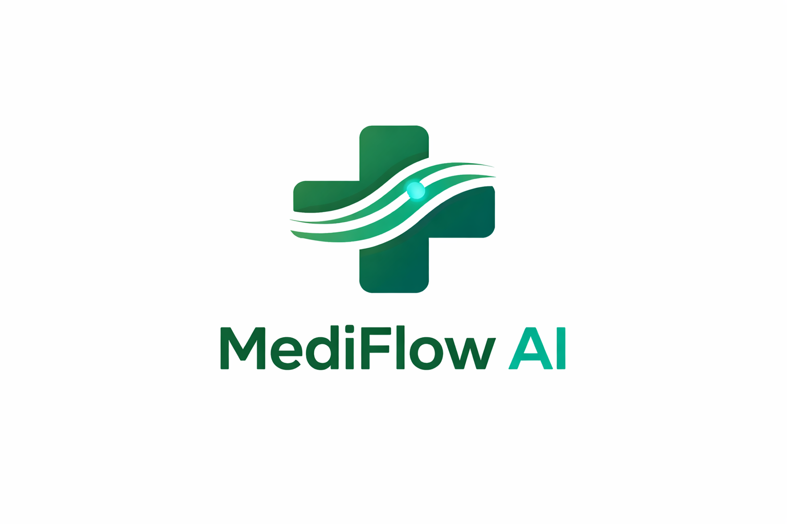

<div align="center">

<p align="center">
  
</p>

### *The Next Generation of Intelligent Clinical Workflow Automation*
<p align="center">
  <a href="https://medi-flow-ai-roan.vercel.app/">
    
  </a>
</p>

[](https://github.com/)
[](https://github.com/)
[](https://github.com/)

<div align="center">


<br/><br/>

---

### **Autonomous Healthcare Operations Agent with Compliance Guardrails**
*Encodes clinical workflows → Executes via multi-agent system → Produces auditable, compliant insurance decisions in seconds*

**[Predictive Diagnostics]** • **[Seamless Integration]** • **[Real-time Analytics]**

---

</div>

## 📖 Overview
MediFlow AI isn't just a chatbot; it's a specialized orchestration engine designed to handle the high-stakes logic of medical insurance and clinical workflows...


</div>

---

## 📋 Table of Contents

- [What Is This?](#-what-is-this)
- [The Problem](#-the-problem)
- [The Solution: Agent Pipeline](#-the-solution-agent-pipeline)
- [Demo](#-demo)
- [Certificates](#-certificates)
- [Certificates](#-certificate)
- [Quick Start](#-quick-start)
- [Project Structure](#-project-structure)
- [Agent Design](#-agent-design)
- [Execution Flow](#-execution-flow)
- [Tech Stack](#-tech-stack)
- [Impact Model](#-impact-model)
- [Roadmap](#-roadmap)

---

## 🧠 What Is This?

Healthcare insurance workflows are **manual, slow, and error-prone**.

Doctors write clinical notes → humans manually convert them into billing codes → compliance teams validate policies → prior authorization takes days → claims get rejected → hospitals lose revenue.
MediFlow-AI is an actively evolving multi-agent system designed to automate end-to-end healthcare claims processing with compliance guarantees, auditability, and scalable deployment architecture.

This project is being developed as a foundation for real-world healthcare workflow automation systems and production-grade AI infrastructure.

**MediFlow AI replaces this entire pipeline with a 5-agent autonomous system.**

---

## 🚨 The Problem

| Step | Issue |
|------|------|
| Clinical Coding | 23% error rate in ICD-10 mapping |
| Compliance | Complex IRDAI/NHA/TPA rules |
| Prior Auth | 3–7 day delays |
| Claims | High rejection rates |
| Audit | No transparent reasoning |

💸 Estimated loss: **₹47,000 Cr annually**

---

## ⚡ The Solution: Agent Pipeline

```
Clinical Note
    ↓
[Agent 1] Clinical NLP
    ↓
[Agent 2] Compliance Guardian
    ↓
[Agent 3] Prior Authorization
    ↓
[Agent 4] Claims Adjudication
    ↓
[Agent 5] Audit Logger
```

Each agent is **isolated, deterministic, and auditable**.

---

## 🏗 Architecture

```
Frontend (Next.js UI)
        ↓
API Layer (Next.js Serverless Routes)
        ↓
Agent Pipeline Execution
        ↓
LLM (Claude API) / Mock Engine
        ↓
Response → UI Rendering
```

---

## 🎥 Demo  

👉 [Watch Demo Video](./demo-video/MediFlow-AI-PitchVideo.mp4)

---

### 📜 Certificates  

- 📄 [Udyam Registration Certificate](./docs/Udyam%20Registration%20Certificate.pdf)  
- 📄 [Startup Authorization Certificate](./docs/MediFlow_Authorization_Certificate.pdf)  
- 📄 [Self Declaration Certificate](./docs/MediFlow_Self_Declaration_Certificate.pdf)

---


## 🚀 Quick Start

### Install

```bash
git clone https://github.com/Nitanshu715/MediFlow-AI
cd MediFlow-AI
npm install
```

### Run

```bash
npm run dev
```

Open:
```
http://localhost:3000
```

---

## 📁 Project Structure

```
mediflow-ai/
├── app/
│   ├── analyze/
│   ├── audit/
│   ├── architecture/
│   └── api/agents/
├── components/
├── lib/
├── public/
```

---

## 🧠 Agent Design

### Agent 1 — Clinical NLP
- Extracts symptoms, diagnoses
- Maps to ICD-10 / CPT

### Agent 2 — Compliance Guardian
- Validates policies
- Provides rule citations

### Agent 3 — Prior Authorization
- Generates approval letter
- Predicts probability

### Agent 4 — Claims Adjudication
- Decision: Approve / Review / Reject
- Fraud detection signals

### Agent 5 — Audit Logger
- SHA-256 logs
- Full traceability

---

## 🔄 Execution Flow

```
Input Clinical Note
        ↓
Structured Medical Data
        ↓
Compliance Evaluation
        ↓
Authorization Generation
        ↓
Claim Decision
        ↓
Audit Log Output
```

---

## 🛠 Tech Stack

```
Frontend      → Next.js 14 + TypeScript
Backend       → Serverless API Routes
AI Engine     → Claude API
Database      → Supabase (optional)
Deployment    → Vercel
```

---

## 📊 Impact Model

| Metric | Value |
|--------|------|
| Time per claim | 6 hours → 28 sec |
| Error reduction | 23% → ~3% |
| Auth delay | 7 days → <1 min |
| Cost saving | ₹2.4 Cr/hospital/year |

---

## 🗺 Roadmap

- [x] Multi-agent pipeline
- [x] Live UI demo
- [x] Serverless backend
- [ ] Real-time streaming agents
- [ ] EHR integrations
- [ ] Production compliance layer

---

<br/>

> **By: Nitanshu Tak**

<br/>

<div align="center">

**Built for ET GenAI Hackathon 2026 — PS-5**

*Healthcare automation, compliance, and AI agents combined into a production-ready system.*

</div>

